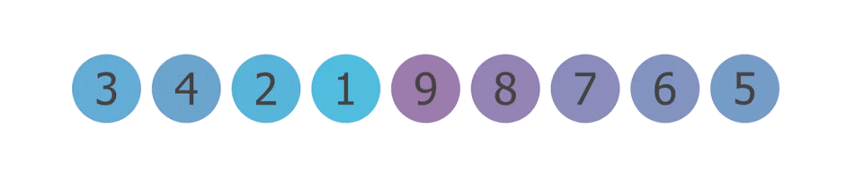

# Sorting Algorithms
This is a list of common sorting algorithms with a brief description of how they work.
- Bubble Sort
- Insertion Sort
- Selection Sort
- Merge Sort
- Quicksort
- Heapsort
- Counting Sort
- Radix Sort
- Bucket Sort
- Shellsort

## Bubble Sort
Bubble sort repeatedly steps through a list, compares adjacent elements, and swaps them if they are in the wrong order.

+ Worst case performance: O(n^2)
+ Best case performance: O(n)
+ Average performance: O(n^2)

## Insertion Sort
 Insertion sort builds a sorted list by inserting each element into its correct position in the final sorted list.
+ Worst case performance: O(n^2)
+ Best case performance: O(n)
+ Average performance: O(n^2)

## Selection Sort
Selection sort finds the minimum element in the unsorted list, swaps it with the first element, and repeats for the remainder of the list.
+ Worst case performance: O(n^2)
+ Best case performance: O(n^2)
+ Average performance: O(n^2)

## Merge Sort
Merge sort recursively divides a list into sublists until each sublist has 1 element, then merges the sublists back together in sorted order. Uses divide-and-conquer.
+ Worst case performance: O(n log n)
+ Best case performance: O(n log n)
+ Average performance: O(n log n)

## Quicksort
Quicksort chooses a pivot element and partitions the list into two sublists - elements less than the pivot and elements greater than the pivot. Recursively sorts the sublists.
+ Worst case performance: O(n^2)
+ Best case performance: O(n log n)
+ Average performance: O(n log n)

## Heapsort
Heapsort converts the list into a max heap, where each node is larger than its children. Extracts each element in descending order by swapping the root with the last leaf.
+ Worst case performance: O(n log n)
+ Best case performance: O(n log n)
+ Average performance: O(n log n)

## Counting Sort
Counting sort counts the number of elements with each distinct key value, then uses these counts to position elements in the output list. Works for integers only.
+ Worst case performance: O(n+k)
+ Best case performance: O(n+k)
+ Average performance: O(n+k)

## Radix Sort
Radix sort sorts integers by digit (least to most significant) using counting sort on each digit.
+ Worst case performance: O(nk)
+ Best case performance: O(nk)
+ Average performance: O(nk)

## Bucket Sort
Bucket sort divides elements into "buckets" based on value ranges, sorts each bucket, and concatenates final output.
+ Worst case performance: O(n^2)
+ Best case performance: O(n+k)
+ Average performance: O(n+k)

## Shellsort
Shellsort is an in-place comparison sort that improves on insertion sort by comparing elements separated by a "gap." The gap is reduced over iterations.
+ Worst case performance: O(n^2)
+ Best case performance: O(n log n)
+ Average performance: depends on gap sequence
