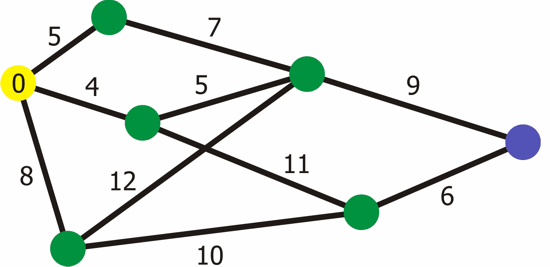

# Graphs

## Dijkstra

Dijkstra's algorithm is used to find the shortest path between two nodes in a graph. Some key properties and uses of Dijkstra's algorithm include:

* It is used to find the shortest path from a starting node to all other nodes in a weighted graph. The weights on edges can represent distances, costs, etc.
* Works on graphs with nonnegative edge weights. Does not work for graphs with negative edge weights.
* Uses a greedy approach to iteratively calculate shortest paths and update distances.
* At each iteration, it finds the unvisited node with the smallest known distance from the start node, calculates its distance from its neighbors, and updates the neighbor distances if shorter paths are found.
* Maintains a priority queue (often implemented with a min heap) to efficiently find the node with lowest distance at each step.
* Runs in O(E log V) time, where E is the number of edges and V is the number of vertices/nodes.
* Key applications include route planning, network routing, and any problem that requires finding shortest paths on a graph.
